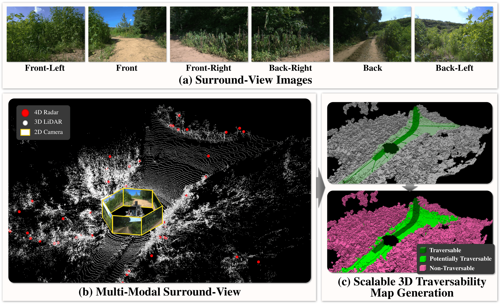
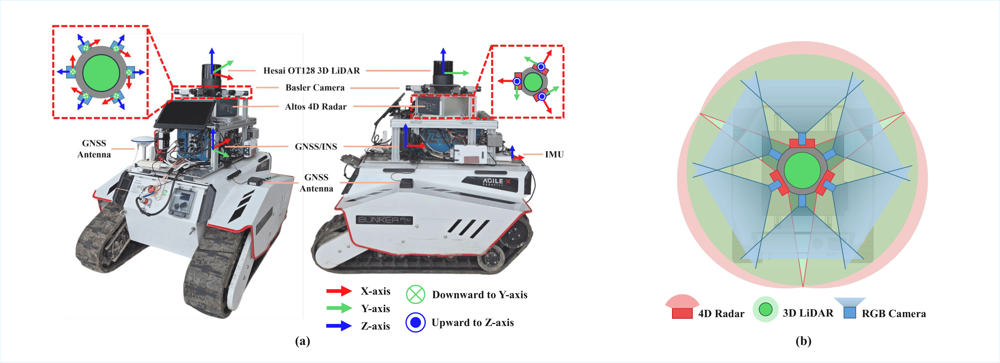

<div align="center">

# 🌄🚗 STONE Dataset
### A Scalable Multi-Modal Surround-View 3D Traversability Dataset  
### for Off-Road Robot Navigation

</div>

<p align="center">

</p>

<p align="center">

<a href="https://konyul.github.io/STONE-dataset/assets/paper/final_paper_compressed.pdf">

</a>

<a href="https://konyul.github.io/STONE-dataset">

</a>

</p>

<br>

<p align="center">
<b>📷 Example Scenes from the STONE Dataset</b>
</p>

<p align="center">

</p>

<br>

## 📢 Updates

- **[2026-03]** We opened the [STONE Dataset GitHub](https://github.com/konyul/STONE).
- **[2026-03]** We opened the [STONE Dataset Website](https://konyul.github.io/STONE-dataset).
- **[2026-02]** Our paper has been accepted to ICRA 2026.

<br>

## 🔜 Upcoming

- **[2026]** The final dataset will be released. Download will be available via a Google Form.
<br>

## 🌍 Overview

**STONE** is a large-scale multi-modal dataset designed for **off-road navigation and 3D traversability prediction**.

Key features of **STONE** include:

- **Trajectory-guided 3D traversability maps** generated by a fully automated labeling pipeline
- **Multi-modal surround-view sensing** with 128-channel LiDAR, six RGB cameras, and three 4D imaging radars
- **Diverse environments and conditions**, including grasslands, farmlands, construction sites, lakes, and both day and night scenarios
- **Geometry-aware labeling** based on terrain attributes such as slope, elevation, and roughness
- **Benchmark for voxel-level 3D traversability prediction** with single-modal and multi-modal baselines

<br>

## 🤖 Robot Platform & Sensor Setup

<p align="center">

</p>

**Platform**
- **UGV**: Bunker Pro
- **Operating System**: Ubuntu 22.04
- **Framework**: ROS 2 Humble

**Sensors**
- **360° Rotating LiDAR**: 1 × Hesai OT128
- **Multi-view RGB Cameras**: 6 × Basler ACE2 2A1920-51gcPRO
- **4D Imaging Radars**: 3 × Continental ARS 548 RDI
- **GNSS/INS**: NovAtel PIM222A dual-antenna GNSS/INS
- **IMU**: EPSON G366P

<br>

## 📊 Dataset
The STONE dataset provides voxel-level 3D traversability annotations.

**Traversability classes**

The dataset contains **4 classes**:

| Class ID | Label |
|--------|--------|
| 0 | Free |
| 1 | Traversable |
| 2 | Potentially Traversable |
| 3 | Non-Traversable |

Ground-truth labels are provided as **`labels.npz`** files.

**Voxel configuration**

- **Voxel size:** `[0.2 m, 0.2 m, 0.2 m]`
- **Range:** `[-25.6 m, -25.6 m, -2.0 m, 25.6 m, 25.6 m, 4.4 m]`
- **Volume size:** `[256, 256, 32]`

**Dataset Structure**
- The dataset structure follows the conventions of [**nuScenes**](https://www.nuscenes.org/) and [**Occ3D-nuScenes**](https://github.com/Tsinghua-MARS-Lab/Occ3D).
- The **4D radar data** are provided in **ROS bag format (`.bag`)**.
- The hierarchy of folder is described below:

```text
STONE_Dataset
│
├── gts
│   └── [scene_name]
│       └── [frame_token]
│           └── labels.npz
│
├── samples
│   ├── CAM_BACK
│   │   └── n001-2025-08-22-07-14-16+0900__CAM_BACK__1755846856289490.jpg
│   ├── CAM_BACK_LEFT
│   │   └── ...
│   ├── CAM_BACK_RIGHT
│   │   └── ...
│   ├── CAM_FRONT
│   │   └── ...
│   ├── CAM_FRONT_LEFT
│   │   └── ...
│   ├── CAM_FRONT_RIGHT
│   │   └── ...
│   └── LIDAR_TOP
│       └── n001-2025-08-22-07-14-16+0900__LIDAR_TOP__1755846856289490.pcd.bin
│
└── v1.0-trainval
    ├── attribute.json
    ├── calibrated_sensor.json
    ├── category.json
    ├── ego_pose.json
    ├── instance.json
    ├── lidarseg.json
    ├── log.json
    ├── map.json
    ├── sample.json
    ├── sample_annotation.json
    ├── sample_data.json
    ├── scene.json
    ├── sensor.json
    └── visibility.json
```
<br>

## 📥 Download

The STONE dataset will be released through a Google Form.

Please fill out the form to request access.  
The download link will be provided after approval.

- Dataset: Coming Soon
- Radar ROS bags: Coming Soon

<br>

## 📜 License

<p>


</p>

The **STONE dataset** is published under the **Creative Commons Attribution–NonCommercial–NoDerivatives 4.0 International License (CC BY-NC-ND 4.0)**.

All **codes in this repository** are released under the **Apache License 2.0**.

Under the **CC BY-NC-ND 4.0 license**, the dataset may be used for **non-commercial research purposes only**.  
Users must give appropriate credit to the original authors when using the dataset.

For more details, please refer to:

- https://creativecommons.org/licenses/by-nc-nd/4.0/
- https://www.apache.org/licenses/LICENSE-2.0
